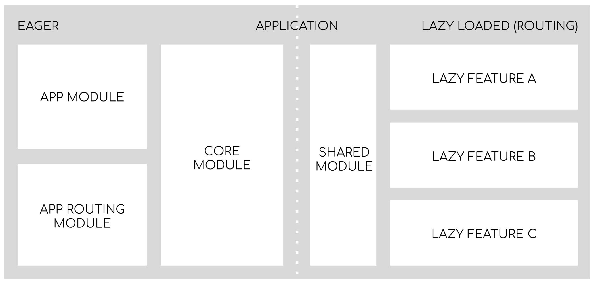

# Angular Base Architecture
Creating a new Angular application with clean, maintainable and extendable architecture.

- [Angular Base Architecture](#angular-base-architecture)
  - [Workspace](#workspace)
  - [Application](#application)
  - [The Application Architecture](#the-application-architecture)
  - [Core Module](#core-module)
  - [Layout](#layout)
  - [The Lazy Modules](#the-lazy-modules)
  - [The Shared Module](#the-shared-module)
  - [Routing and Layouts](#routing-and-layouts)
    - [Handling Routes](#handling-routes)
  - [Changes to code](#changes-to-code)

## Workspace
Generate fresh new Angular workspace and this can be achieved by running
```sh
ng new angular-architecture-base --create-application false --strict --prefix gk
```
## Application

```sh
ng g application control-app --prefix gk --style css --routing
ng g application monitor-app --prefix gk --style scss --routing
```
## The Application Architecture


Application will have 2 main parts…
- The eager part which will be loaded from start (the main.js bundle). It will contain the AppModule with top-level routes and CoreModule with basic layout and all the core singleton services which will be used throughout the whole application.
- The lazy loaded features which will be loaded as a result of user navigation to these features. The lazy modules will also import SharedModule. This will be a result of carefully evaluated trade-off between smallest possible bundle size and reasonable developer experience!
  
## Core Module

```sh
ng g m core

cat > projects/control-app/src/app/core/core.module.ts <<'EOL'
// projects/control-app/src/app/core/core.module.ts
import { NgModule } from '@angular/core';
import { RouterModule } from '@angular/router';
import { BrowserModule } from '@angular/platform-browser';
import { BrowserAnimationsModule } from '@angular/platform-browser/animations';

@NgModule({
  declarations: [],
  imports: [
    // vendor
    BrowserModule,
    BrowserAnimationsModule,
    RouterModule,
  ]
})
export class CoreModule { }
EOL

cat > projects/control-app/src/app/app.module.ts <<'EOL'
// projects/control-app/src/app/app.module.ts
import { CoreModule } from './core/core.module';
import { NgModule } from '@angular/core';
import { AppRoutingModule } from './app-routing.module';
import { AppComponent } from './app.component';

@NgModule({
  declarations: [
    AppComponent
  ],
  imports: [
    CoreModule,
    AppRoutingModule
  ],
  providers: [],
  bootstrap: [AppComponent]
})
export class AppModule { }
EOL
cat > projects/control-app/src/app/app.component.html <<'EOL'
<h1>Hello World!</h1>
<p>control-app app is running!</p>
EOL


```

## Layout
```sh
ng add @angular/material
ng g c core/layout/main-layout
```


## The Lazy Modules
```sh
ng g m features/home --route home --module app.module.ts
ng g m features/admin --route admin --module app.module.ts
ng g m features/pages --route admin --module app.module.ts
```
## The Shared Module
```sh
ng g m shared
```

what should we put into it?
declarables (components, directives and pipes) which we want to use in multiple lazy features
components from libraries (vendor / material / your component framework)
re-export CommonModule (it implements stuff like *ngFor, *ngIf, … )

TIP: Shared module will be imported by many lazy loaded features and because of that it should NEVER implement any services (providers: [ ]) and only contain declarables (components, directives and pipes) and modules (which only contain declarables).
Creating and using necessary components
```sh
ng g c core/layout/footer --module core
ng g c core/layout/header --module core

ng g c shared/loading --module shared
ng g c shared/dform --module shared
ng g c shared/filters --module shared

```
## Routing and Layouts

###  Handling Routes
Add below two routes to routing module to handle un-defined routes
**File:** projects/my-epic-app/src/app/app-routing.module.ts

```typescript
  { path: '', pathMatch: 'full', redirectTo: 'home' },
  { path: '**', redirectTo: 'home' }
```
##  Changes to code


```sh
cat > projects/control-app/src/app/core/core.module.ts <<'EOL'
// projects/control-app/src/app/core/core.module.ts
import { NgModule, Optional, SkipSelf } from '@angular/core';
import { RouterModule } from '@angular/router';
import { BrowserModule } from '@angular/platform-browser';
import { BrowserAnimationsModule } from '@angular/platform-browser/animations';
import { MatButtonModule } from '@angular/material/button';
import { MatToolbarModule } from '@angular/material/toolbar';

import { MainLayoutComponent } from './layout/main-layout/main-layout.component';

@NgModule({
  declarations: [MainLayoutComponent],
  imports: [
    // vendor
    BrowserModule,
    BrowserAnimationsModule,
    RouterModule,

    // material
    MatToolbarModule,
    MatButtonModule
  ],
  exports: [MainLayoutComponent]
})

export class CoreModule {
  constructor( @Optional() @SkipSelf() parentModule: CoreModule) {
    if (parentModule) {
      throw new Error('CoreModule has already been loaded. You should only import Core modules in the AppModule only.');
    }
  }
}
EOL

cat > projects/control-app/src/app/core/layout/main-layout/main-layout.component.html <<'EOL'
<mat-toolbar color="primary">
  <h1>Hello World!</h1>

  <span class="spacer"></span>

  <button mat-flat-button color="primary" routerLink="home" routerLinkActive="active">Home</button>
  <button mat-flat-button color="primary" routerLink="admin" routerLinkActive="active">Admin</button>
</mat-toolbar>

<main>
  <p>control app is running!</p>
  <router-outlet></router-outlet>
</main>
EOL
```

```sh
cat > projects/control-app/src/app/app.component.html <<'EOL'
<gk-main-layout></gk-main-layout>
EOL
```
